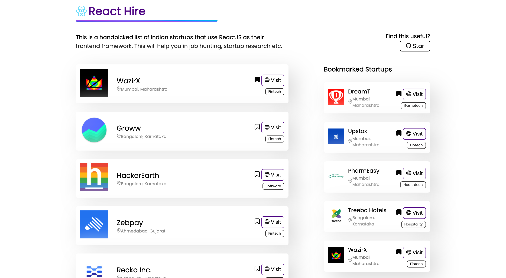

# Hi👋, this is React-Hire

`One place to find all ReactJS Startups`

  
  

## Why React-Hire?

Imagine you're on treasure hunt but you don't have a map. Sounds absurdm, right? This is how we do job hunting. We randomly look for startups, their career page and spend hours only to see that they are not using framework/tech that we know (in this case ReactJS). So, to ease your pain a little, this website will show you all the Indian Startups, personally verified that are using ReactJS as their frontend framework.

## Upcoming feature?

<ul>
<li>Search Option</li>
<li>Sort and Filter</li>
<li>Full fleged backend</li>
</ul>

## Want to run locally?

I am using NextJS for this repo, clone this code by using:
`git clone https://github.com/shuvamk/react-hire.git`
then go to directory:
`cd react-hire`
install npm packages:
`npm i`
run dev server:
`npm run dev`
The project will be started on localhost:3000

## Want to make a contribution?

- Make any change you want and raise a PR.
- Add more companies to the list.
